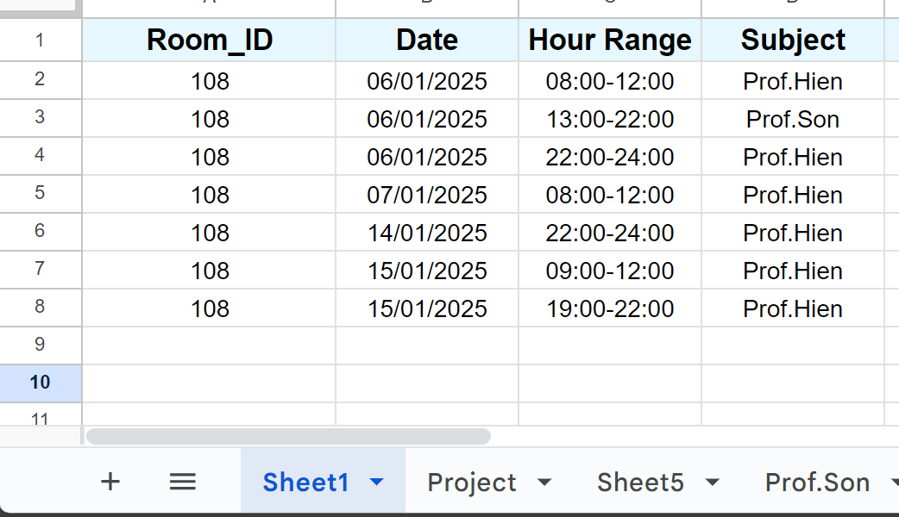
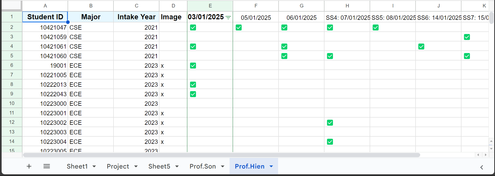

# Face Recognition and Attendance System

This project implements a **real-time face recognition and attendance tracking system** with liveness detection. It ensures accurate identification of individuals and prevents spoofing attacks.

## Features

- **Real-time face detection and recognition**
- **Liveness detection** to distinguish real faces from spoofed ones
- Integration with **Google Sheets** to update attendance
- Support for adding new face embeddings dynamically
- CSV-based storage of face embeddings
- Continuous recognition with a timer to prevent duplicate attendance entries

## Prerequisites

### Software Requirements
- Python 3.7+
- Google Cloud service account credentials for accessing Google Sheets

### Python Dependencies
Install the required Python packages:
```bash
pip install -r requirements.txt
```

### Required Files
- `requirements.txt`: List of required Python dependencies.
- `smart-445016-ead681048f50.json`: Google Cloud service account credentials.
- `embeddings.csv`: File to store face embeddings and IDs.
- Models for liveness detection (e.g., `2.7_80x80_MiniFASNetV2.pth`, `4_0_0_80x80_MiniFASNetV1SE.pth`).
- InsightFace model files (e.g., `buffalo_m/w600k_r50.onnx`).

## Project Structure

- **`main.py`**: The main script for real-time face recognition and attendance tracking.
- **`resources/anti_spoof_models`**: Directory containing models for liveness detection.
- **`embeddings.csv`**: CSV file storing face embeddings and IDs.
- **`smart-445016-ead681048f50.json`**: Google Cloud service account credentials (replace with your file).

## Setup

### 1. Configure Google Sheets

1. **Create a New Google Sheet**:
   - Open Google Sheets and create a new spreadsheet.
   - Set up the headers in the first row with the following structure:
     - Column A: `Room_ID` - Represents the ID of the room (e.g., 108).
     - Column B: `Date` - Specifies the session's date in the format `DD/MM/YYYY`.
     - Column C: `Hour Range` - Indicates the session's start and end time (e.g., `08:00-12:00`).
     - Column D: `Subject` - Specifies the subject or instructor name (e.g., `Prof.Hien`, `Prof.Son`).

   Example layout:
   

2. **Add Additional Sheets for Attendance**:
   - Create another sheet (e.g., `Attendance`) with the following structure:
     - Column A: `Student ID` - The unique identifier for each student.
     - Column B: `Major` - The field of study (e.g., `CSE`, `ECE`).
     - Column C: `Intake Year` - The year the student joined (e.g., 2021, 2023).
     - Column D: `Image` - A marker (e.g., `x`) indicating the availability of the student's photo.
     - Columns E onward: Dates in the format `DD/MM/YYYY` to track attendance, where a ✅ indicates the student was present.

   Example layout:
   

3. **Share the Sheet**:
   - Open the `.json` credentials file and locate the `client_email` field.
   - Share the Google Sheet with the email address listed in `client_email`.
   - Grant **Editor** permissions to ensure the script can update attendance records.

4. **Update the Script**:
   - Replace the `SHEET_NAME` variable in `main.py` with the name of your Google Sheet:
     ```python
     SHEET_NAME = "YourGoogleSheetName"
     ```
   - Verify the connection by running the script. It will prompt for selecting the correct sheet if multiple exist.

5. **Verify Formatting**:
   - Ensure each sheet matches the specified format. Attendance marking (✅ for present, blank for absent) should align with the attendance sheet's layout.
   - Ensure the `Room_ID`, `Date`, and `Hour Range` columns in `Sheet1` align with the session schedule.

### 2. Install Python Dependencies
Install the required Python packages using the provided `requirements.txt` file:
```bash
pip install -r requirements.txt
```

### 3. Configure Face Models
1. Download InsightFace models and place them in a folder (`buffalo_m/`):
   - **`det_2.5g.onnx`**: Face detection model
   - **`w600k_r50.onnx`**: Face recognition model
2. Ensure the `buffalo_m/` folder is in the same directory as `main.py`.

### 4. Run the Script
Run the script to start real-time face recognition:
```bash
python main.py
```

## How It Works

1. **Face Detection**:
   - Detects faces using the InsightFace detection model.
2. **Face Recognition**:
   - Matches detected faces with saved embeddings in `embeddings.csv`.
3. **Liveness Detection**:
   - Ensures the detected face is real using anti-spoofing models.
4. **Attendance Update**:
   - Marks attendance for recognized individuals in Google Sheets if they are continuously recognized for 3 seconds.

## Key Functions

### `choose_google_sheet(client, workbook_name)`
Prompts the user to select a sheet (class) from a Google Sheets workbook.

### `update_attendance(student_id)`
Updates attendance for a specific `student_id` based on the current date in Google Sheets.

### `load_embeddings(csv_path)`
Loads face embeddings and corresponding IDs from the CSV file.

### `compare_embeddings(embedding, saved_embeddings, threshold=0.5)`
Compares a face embedding with saved embeddings using cosine similarity.

### `detect_liveness(frame, model_test, image_cropper, model_dir)`
Performs liveness detection on a detected face.

### `run_realtime_face_recognition(csv_path, model_dir, device_id)`
Main function to run real-time face recognition and attendance tracking.

## Usage

- **Press `q`**: Exit the application.
- **Press `s`**: Save new face embeddings dynamically by entering an ID.

## Beginner's Manual

### Step-by-Step Guide

1. **Install Python**
   - Ensure Python 3.7+ is installed. Download it from [Python's official site](https://www.python.org/downloads/).

2. **Set Up the Environment**
   - Install the required dependencies:
     ```bash
     pip install -r requirements.txt
     ```

3. **Prepare the Google Sheet**
   - Create a Google Sheet.
   - Share it with the service account email provided in `smart-445016-ead681048f50.json`.
   - Update the `SHEET_NAME` variable in `main.py` to match your Google Sheet's name.

4. **Download the Models**
   - Place all required models in the appropriate folders.

5. **Run the Script**
   - Start the program:
     ```bash
     python main.py
     ```
   - Follow on-screen instructions to manage embeddings or update attendance.

6. **Test the System**
   - Use a webcam to recognize faces and update attendance.

### Adjusting Code for Raspberry Pi 5 Using PiCamera2

To run the code on Raspberry Pi 5 and utilize the PiCamera2 library for camera input, follow these additional steps:

#### Hardware Requirements
1. **Raspberry Pi 5**
   - Ensure you have a Raspberry Pi 5 with sufficient power supply.
2. **Camera Module**
   - Raspberry Pi Camera Module (compatible with PiCamera2 library).
   - Alternatively, any USB camera compatible with OpenCV.
3. **SD Card**
   - A high-speed SD card with at least 16GB capacity.
4. **Cooling System**
   - Optional, but recommended for intensive tasks like face recognition (e.g., heat sink or fan).
5. **Monitor, Keyboard, and Mouse**
   - For initial setup and debugging.

#### Software Requirements
1. **Operating System**
   - Raspberry Pi OS (Bullseye or newer).
   - Ensure the system is updated:
     ```bash
     sudo apt update && sudo apt upgrade -y
     ```
2. **Python Environment**
   - Python 3.7+ pre-installed on Raspberry Pi OS.
3. **PiCamera2 Library**
   - Required for camera integration:
     ```bash
     sudo apt install python3-picamera2
     ```
4. **Additional Libraries**
   - OpenCV and other dependencies:
     ```bash
     sudo apt install python3-opencv libatlas-base-dev
     pip3 install -r requirements.txt
     ```

---

#### 1. Install Dependencies
Ensure all required dependencies, including PiCamera2, are installed:
```bash
sudo apt update
sudo apt install python3-picamera2 python3-opencv libatlas-base-dev
pip3 install -r requirements.txt
```

#### 2. Enable the Camera
Enable the Raspberry Pi camera via `raspi-config`:
```bash
sudo raspi-config
```
- Navigate to **Interface Options > Camera** and enable it.
- Reboot the Raspberry Pi:
```bash
sudo reboot
```

#### 3. Update Camera Code to Use PiCamera2
Modify `main.py` to use the PiCamera2 library for video capture. Replace the existing `cv2.VideoCapture` code with the following:
```python
from picamera2 import Picamera2
import cv2

# Initialize PiCamera2
picam2 = Picamera2()
picam2.configure(picam2.create_preview_configuration(main={"size": (640, 480)}))
picam2.start()

while True:
    frame = picam2.capture_array()
    # Add your face recognition and processing code here
    cv2.imshow("Face Recognition", frame)

    if cv2.waitKey(1) & 0xFF == ord('q'):
        break

cv2.destroyAllWindows()
```

#### 4. Optimize Model Loading for Pi
Given the limited resources on Raspberry Pi, ensure lightweight models are used. Modify `main.py` to load models optimized for embedded devices. For example:
```python
model_dir = "./resources/lightweight_models"
```

#### 5. Reduce Frame Size for Performance
To improve performance, downscale the frames before processing:
```python
frame = cv2.resize(frame, (320, 240))
```

#### 6. Test and Debug
Run the script on Raspberry Pi 5:
```bash
python3 main.py
```
Check logs for any issues and optimize further if necessary.

---

## Acknowledgments

- [InsightFace](https://github.com/deepinsight/insightface): Open-source 2D and 3D deep face analysis toolbox.
- [Google Sheets API](https://developers.google.com/sheets/api): For attendance tracking.
- [OpenCV](https://opencv.org/): For real-time video processing.

## License

This project is licensed under the MIT License. See the LICENSE file for details.
